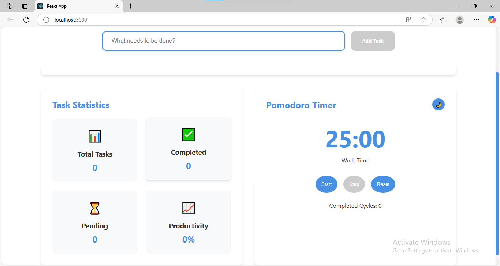

# Smart Task Manager Dashboard

A modern, interactive task management application built with React that demonstrates the use of various React Hooks and features. This application allows users to manage tasks, track productivity, and use a Pomodoro timer for better time management.



## Features

### Core Features
- Task Management
  - Add new tasks
  - Mark tasks as complete/incomplete
  - Delete tasks
  - Filter tasks (All/Completed/Pending)
  - Sort tasks (Created Date/Completion Status/Alphabetical)

### Advanced Features
- Pomodoro Timer
  - Work/Break sessions
  - Start/Stop/Reset functionality
  - Cycle tracking
  - Visual timer display

### Task Statistics
- Total tasks count
- Completed tasks
- Pending tasks
- Productivity score
- Real-time updates

### Theme Support
- Light/Dark mode toggle
- Persistent theme preference
- Smooth theme transitions

## React Hooks Implementation

The project demonstrates the use of various React Hooks:

| Hook | Use Case 1 | Use Case 2 |
|------|------------|------------|
| useState | Store task list | Toggle task completion |
| useEffect | Sync tasks to localStorage | Load tasks on mount |
| useReducer | Manage task list | Handle timer logic |
| useRef | Focus input | Track timer interval ID |
| useContext | Theme context | Task stats context |
| useMemo | Memoize filtered tasks | Memoize completion stats |
| useCallback | Add/remove tasks | Control timer |
| useLayoutEffect | Scroll to latest task | Layout adjustment |
| Custom Hook | useLocalStorage | usePomodoroTimer |

## Project Structure
/src
/components
TaskInput.jsx
TaskList.jsx
TaskStats.jsx
Timer.jsx
App.jsx
index.js


## Getting Started

### Prerequisites
- Node.js (v14.0.0 or higher)
- npm (v6.0.0 or higher)

### Installation

1. Clone the repository:
```bash
git clone https://github.com/yourusername/smart-task-manager.git
cd smart-task-manager
```

2. Install dependencies:
```bash
npm install
```

3. Start the development server:
```bash
npm start
```

4. Open [http://localhost:3000](http://localhost:3000) to view it in your browser.

## Usage

### Adding Tasks
1. Type your task in the input field
2. Click "Add Task" or press Enter
3. The task will appear in your task list

### Managing Tasks
- Click the checkbox to mark a task as complete
- Use the "Complete" button to toggle task status
- Click "Delete" to remove a task
- Use the filter buttons to view different task categories
- Use the sort dropdown to organize tasks

### Using the Pomodoro Timer
1. Click "Start" to begin a work session
2. The timer will count down from 25 minutes
3. After the work session, a 5-minute break will start automatically
4. Use "Stop" to pause the timer
5. Use "Reset" to start over

### Theme Toggle
- Click the sun/moon icon in the header to switch between light and dark themes

## Custom Hooks

### useLocalStorage
- Manages state persistence in localStorage
- Used for tasks and theme preference
- Automatically syncs state changes

### usePomodoroTimer
- Manages Pomodoro timer state and logic
- Handles work/break cycles
- Tracks completed cycles

## Contributing

1. Fork the repository
2. Create your feature branch (`git checkout -b feature/AmazingFeature`)
3. Commit your changes (`git commit -m 'Add some AmazingFeature'`)
4. Push to the branch (`git push origin feature/AmazingFeature`)
5. Open a Pull Request

## License

This project is licensed under the MIT License - see the [LICENSE](LICENSE) file for details.

## Acknowledgments

- React Documentation
- MDN Web Docs
- Pomodoro Technique®
